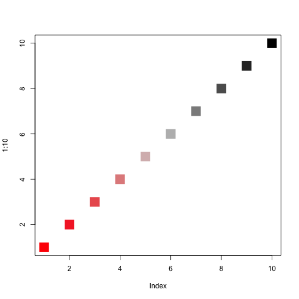
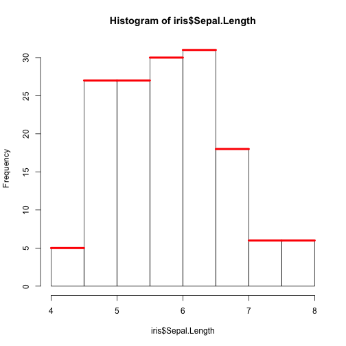
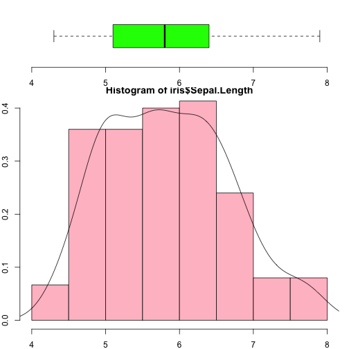
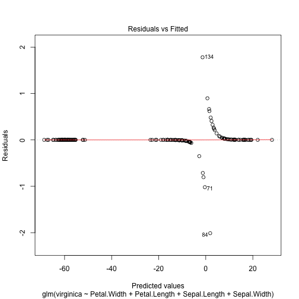
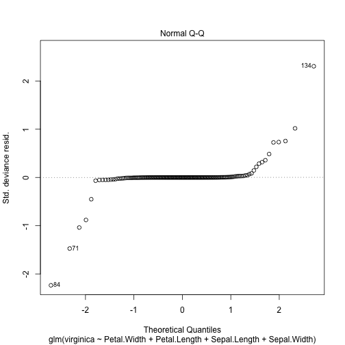
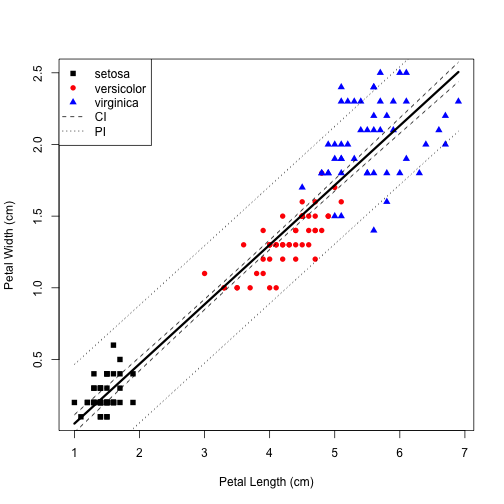

# Libraries used


```r
install.packages(c("broom", "xtable", "gee", "RColorBrewer", "gplots"))
```

# Exploring the Iris dataset

## Basic introduction to the dataset:

```r
data(iris)
dim(iris)
```

```
## [1] 150   5
```

```r
class(iris)
```

```
## [1] "data.frame"
```

```r
summary(iris)
```

```
##   Sepal.Length    Sepal.Width     Petal.Length    Petal.Width   
##  Min.   :4.300   Min.   :2.000   Min.   :1.000   Min.   :0.100  
##  1st Qu.:5.100   1st Qu.:2.800   1st Qu.:1.600   1st Qu.:0.300  
##  Median :5.800   Median :3.000   Median :4.350   Median :1.300  
##  Mean   :5.843   Mean   :3.057   Mean   :3.758   Mean   :1.199  
##  3rd Qu.:6.400   3rd Qu.:3.300   3rd Qu.:5.100   3rd Qu.:1.800  
##  Max.   :7.900   Max.   :4.400   Max.   :6.900   Max.   :2.500  
##        Species  
##  setosa    :50  
##  versicolor:50  
##  virginica :50  
##                 
##                 
## 
```

```r
head(iris)
```

```
##   Sepal.Length Sepal.Width Petal.Length Petal.Width Species
## 1          5.1         3.5          1.4         0.2  setosa
## 2          4.9         3.0          1.4         0.2  setosa
## 3          4.7         3.2          1.3         0.2  setosa
## 4          4.6         3.1          1.5         0.2  setosa
## 5          5.0         3.6          1.4         0.2  setosa
## 6          5.4         3.9          1.7         0.4  setosa
```

```r
sapply(iris, class)
```

```
## Sepal.Length  Sepal.Width Petal.Length  Petal.Width      Species 
##    "numeric"    "numeric"    "numeric"    "numeric"     "factor"
```

## Plotting
Default plot for a numeric variable:

```r
plot(iris$Sepal.Length)
```

 

For two numeric variables:

```r
plot(iris$Sepal.Length, iris$Sepal.Width)
```

 

Equivalently using the formula interface:

```r
plot(iris$Sepal.Width ~ iris$Sepal.Length)
```

Or:

```r
pdf("iris1.pdf")
plot(Sepal.Width ~ Sepal.Length, data=iris)
dev.off()
```

## Details in plotting

Make it look a better. Look at ?plot and ?plot.default.  Play with type, ylim, log, main, sub, xlab, ylab, pch, cex.  Explore different output devices, and RStudio "Export."

Do again, using different shapes (pch) or colors (col) for each species.  Add a legend.


```r
plot(1:20, pch=1:20)
```

 

```r
plot(1:20, pch=c(".", "a", "dog"))
```

 

## Color palettes.
Several package provide color palettes:

```r
library(RColorBrewer)
display.brewer.all(n=3)
```

 

```r
brewer.pal(3, "Set2")
```

```
## [1] "#66C2A5" "#FC8D62" "#8DA0CB"
```

You can also create your own:

```r
plot(1:10, col=colorRampPalette(c("red", "lightgrey", "black"))(10), pch=15, cex=3)
```

 

**Exercise** try creating and using some different color palettes


```r
plot(Sepal.Width ~ Sepal.Length, data=iris, 
     col=brewer.pal(3, "Set2")[iris$Species])
legend(x=6.5, y=4.5, legend=levels(iris$Species), 
       col=brewer.pal(3, "Set2"), pch=1)
```

 

**Note:** how did I know to do x$mids, x$counts?

```r
x <- hist(iris$Sepal.Length)
segments(x0=x$mids-0.25, x1=x$mids+0.25, y0=x$counts, y1=x$counts, lw=4, col="red")
```

 

How about a boxplot with histogram together? (see http://rgraphgallery.blogspot.com/search/label/boxplot)

```r
layout(mat = matrix(c(1,2), 2, 1, byrow=TRUE),  height = c(1,3))
par(mar=c(2, 2, 0.5, 1))
boxplot(iris$Sepal.Length, horizontal=TRUE,  outline=TRUE,ylim=c(4,8), frame=FALSE, col = "green1")
hist(iris$Sepal.Length,xlim=c(4,8), col = "pink", freq = FALSE)
lines(density(iris$Sepal.Length))
```

 

Boxplot of Sepal width vs. species

```r
boxplot(Sepal.Width ~ Species, data=iris, boxwex=0.25, col="grey")
```

 

```Use dev.off() to clear layout.```


```r
library(gplots)
heatmap.2(t(iris[, 1:4]), trace="none", scale="row", 
          key=TRUE, mar=c(2, 8), cexRow=1, 
          ColSideColors=c("grey", "black", "yellow")[iris$Species])
```

 

See https://bioconductor.org/packages/release/bioc/html/ComplexHeatmap.html for more advanced and interactive heatmaps.

Exploratory pairs plots:

```r
pairs(iris)
```

 

## Final notes on plotting

* The ggplot2 package provides nicer-looking plots by default
* There is a lot to learn: https://mramos.shinyapps.io/obView

# Plotting and exploratory data analysis exercises

Datasets are available at http://goo.gl/x87GY6

## Exercise #1: Iris dataset

Plot petal width vs. petal length for the iris dataset, identifying species using _both_ color and datapoint type.

```r
data(iris)
plot(Petal.Width ~ Petal.Length, col=c("black", "red", "blue")[Species], pch=(15:17)[Species], data=iris)
legend("topleft", legend=levels(iris$Species), col=c("black", "red", "blue"), pch=15:17)
```

 


## Exercise #2: GSE12945

Do exploratory analysis of the GSE12945 dataset, taken from the following paper:

> Staub E, Groene J, Heinze M, Mennerich D et al. An expression module of WIPF1-coexpressed genes identifies patients with favorable prognosis in three tumor types. J Mol Med (Berl) 2009 Jun;87(6):633-44. PMID: 19399471

Dataset is available from http://goo.gl/x87GY6 or by using the following command: 

```r
if(!file.exists("GSE12945.csv"))
  download.file("https://www.dropbox.com/sh/pukanjaahmonmcp/AADWX-vKk70CuGgYWBqqxWjfa/datasets/GSE12945.csv", destfile="GSE12945.csv", method="wget")
gse <- read.csv("GSE12945.csv")
```

# Regression

## Simple Linear Regression Example:

```r
data(iris)
fit <- lm(Petal.Width ~ Petal.Length, data=iris)
class(fit)
```

```
## [1] "lm"
```

```r
methods(class=class(fit))
```

```
##  [1] add1           alias          anova          case.names    
##  [5] coerce         confint        cooks.distance deviance      
##  [9] dfbeta         dfbetas        drop1          dummy.coef    
## [13] effects        extractAIC     family         formula       
## [17] hatvalues      influence      initialize     kappa         
## [21] labels         logLik         model.frame    model.matrix  
## [25] nobs           plot           predict        print         
## [29] proj           qr             residuals      rstandard     
## [33] rstudent       show           simulate       slotsFromS3   
## [37] summary        variable.names vcov          
## see '?methods' for accessing help and source code
```

```r
summary(fit) # show results
```

```
## 
## Call:
## lm(formula = Petal.Width ~ Petal.Length, data = iris)
## 
## Residuals:
##      Min       1Q   Median       3Q      Max 
## -0.56515 -0.12358 -0.01898  0.13288  0.64272 
## 
## Coefficients:
##               Estimate Std. Error t value Pr(>|t|)    
## (Intercept)  -0.363076   0.039762  -9.131  4.7e-16 ***
## Petal.Length  0.415755   0.009582  43.387  < 2e-16 ***
## ---
## Signif. codes:  0 '***' 0.001 '**' 0.01 '*' 0.05 '.' 0.1 ' ' 1
## 
## Residual standard error: 0.2065 on 148 degrees of freedom
## Multiple R-squared:  0.9271,	Adjusted R-squared:  0.9266 
## F-statistic:  1882 on 1 and 148 DF,  p-value: < 2.2e-16
```

## Other useful functions 

```r
coefficients(fit) # model coefficients
predict(fit) # fitted predictions
predict(fit, newdata=data.frame(Petal.Length=seq(1, 2, by=0.1)))
confint(fit, level=0.95) # CIs for model parameters 
fitted(fit) # predicted values
residuals(fit) # residuals
anova(fit) # anova table 
influence(fit) # regression diagnostics
```

The "broom" package can be useful for extracting key results:

```r
library(broom)
```

```
## Error in library(broom): there is no package called 'broom'
```

```r
tidy(fit)
```

```
## Error in eval(expr, envir, enclos): could not find function "tidy"
```

## Diagnostic plots

```r
par(mfrow=c(2,2))
plot(fit)
```

 

## Multiple regression

```r
fit2 <- lm(Petal.Width ~ Petal.Length + Sepal.Length + Sepal.Width, data=iris)
summary(fit2) # show results
```

```
## 
## Call:
## lm(formula = Petal.Width ~ Petal.Length + Sepal.Length + Sepal.Width, 
##     data = iris)
## 
## Residuals:
##      Min       1Q   Median       3Q      Max 
## -0.60959 -0.10134 -0.01089  0.09825  0.60685 
## 
## Coefficients:
##              Estimate Std. Error t value Pr(>|t|)    
## (Intercept)  -0.24031    0.17837  -1.347     0.18    
## Petal.Length  0.52408    0.02449  21.399  < 2e-16 ***
## Sepal.Length -0.20727    0.04751  -4.363 2.41e-05 ***
## Sepal.Width   0.22283    0.04894   4.553 1.10e-05 ***
## ---
## Signif. codes:  0 '***' 0.001 '**' 0.01 '*' 0.05 '.' 0.1 ' ' 1
## 
## Residual standard error: 0.192 on 146 degrees of freedom
## Multiple R-squared:  0.9379,	Adjusted R-squared:  0.9366 
## F-statistic: 734.4 on 3 and 146 DF,  p-value: < 2.2e-16
```

```r
anova(fit, fit2)
```

```
## Analysis of Variance Table
## 
## Model 1: Petal.Width ~ Petal.Length
## Model 2: Petal.Width ~ Petal.Length + Sepal.Length + Sepal.Width
##   Res.Df    RSS Df Sum of Sq      F    Pr(>F)    
## 1    148 6.3101                                  
## 2    146 5.3803  2    0.9298 12.616 8.836e-06 ***
## ---
## Signif. codes:  0 '***' 0.001 '**' 0.01 '*' 0.05 '.' 0.1 ' ' 1
```

## Interaction terms

```r
fit2int <- lm(Petal.Width ~ Petal.Length + Sepal.Length + Sepal.Width + Petal.Length:Sepal.Length, data=iris)
anova(fit2, fit2int)
```

```
## Analysis of Variance Table
## 
## Model 1: Petal.Width ~ Petal.Length + Sepal.Length + Sepal.Width
## Model 2: Petal.Width ~ Petal.Length + Sepal.Length + Sepal.Width + Petal.Length:Sepal.Length
##   Res.Df    RSS Df Sum of Sq      F Pr(>F)
## 1    146 5.3803                           
## 2    145 5.2869  1  0.093357 2.5604 0.1117
```

## Model matrices

```r
tail(model.matrix(~ Species, data=iris))
```

```
##     (Intercept) Speciesversicolor Speciesvirginica
## 145           1                 0                1
## 146           1                 0                1
## 147           1                 0                1
## 148           1                 0                1
## 149           1                 0                1
## 150           1                 0                1
```

```r
tail(iris)
```

```
##     Sepal.Length Sepal.Width Petal.Length Petal.Width   Species
## 145          6.7         3.3          5.7         2.5 virginica
## 146          6.7         3.0          5.2         2.3 virginica
## 147          6.3         2.5          5.0         1.9 virginica
## 148          6.5         3.0          5.2         2.0 virginica
## 149          6.2         3.4          5.4         2.3 virginica
## 150          5.9         3.0          5.1         1.8 virginica
```

## Analysis of covariance

```r
fit3 <- lm(Petal.Width ~ Petal.Length + Sepal.Length + Sepal.Width + Species, data=iris)
summary(fit3)
```

```
## 
## Call:
## lm(formula = Petal.Width ~ Petal.Length + Sepal.Length + Sepal.Width + 
##     Species, data = iris)
## 
## Residuals:
##      Min       1Q   Median       3Q      Max 
## -0.59239 -0.08288 -0.01349  0.08773  0.45239 
## 
## Coefficients:
##                   Estimate Std. Error t value Pr(>|t|)    
## (Intercept)       -0.47314    0.17659  -2.679  0.00824 ** 
## Petal.Length       0.24220    0.04884   4.959 1.97e-06 ***
## Sepal.Length      -0.09293    0.04458  -2.084  0.03889 *  
## Sepal.Width        0.24220    0.04776   5.072 1.20e-06 ***
## Speciesversicolor  0.64811    0.12314   5.263 5.04e-07 ***
## Speciesvirginica   1.04637    0.16548   6.323 3.03e-09 ***
## ---
## Signif. codes:  0 '***' 0.001 '**' 0.01 '*' 0.05 '.' 0.1 ' ' 1
## 
## Residual standard error: 0.1666 on 144 degrees of freedom
## Multiple R-squared:  0.9538,	Adjusted R-squared:  0.9522 
## F-statistic: 594.9 on 5 and 144 DF,  p-value: < 2.2e-16
```

```r
anova(fit2, fit3)
```

```
## Analysis of Variance Table
## 
## Model 1: Petal.Width ~ Petal.Length + Sepal.Length + Sepal.Width
## Model 2: Petal.Width ~ Petal.Length + Sepal.Length + Sepal.Width + Species
##   Res.Df    RSS Df Sum of Sq      F    Pr(>F)    
## 1    146 5.3803                                  
## 2    144 3.9976  2    1.3827 24.904 5.143e-10 ***
## ---
## Signif. codes:  0 '***' 0.001 '**' 0.01 '*' 0.05 '.' 0.1 ' ' 1
```

Make nice tables - see http://cran.r-project.org/web/packages/xtable/vignettes/xtableGallery.pdf.


```r
library(xtable)
print(xtable(fit3), type="html")
```

<!-- html table generated in R 3.3.0 by xtable 1.7-4 package -->
<!-- Sat Oct 17 09:53:49 2015 -->
<table border=1>
<tr> <th>  </th> <th> Estimate </th> <th> Std. Error </th> <th> t value </th> <th> Pr(&gt;|t|) </th>  </tr>
  <tr> <td align="right"> (Intercept) </td> <td align="right"> -0.4731 </td> <td align="right"> 0.1766 </td> <td align="right"> -2.68 </td> <td align="right"> 0.0082 </td> </tr>
  <tr> <td align="right"> Petal.Length </td> <td align="right"> 0.2422 </td> <td align="right"> 0.0488 </td> <td align="right"> 4.96 </td> <td align="right"> 0.0000 </td> </tr>
  <tr> <td align="right"> Sepal.Length </td> <td align="right"> -0.0929 </td> <td align="right"> 0.0446 </td> <td align="right"> -2.08 </td> <td align="right"> 0.0389 </td> </tr>
  <tr> <td align="right"> Sepal.Width </td> <td align="right"> 0.2422 </td> <td align="right"> 0.0478 </td> <td align="right"> 5.07 </td> <td align="right"> 0.0000 </td> </tr>
  <tr> <td align="right"> Speciesversicolor </td> <td align="right"> 0.6481 </td> <td align="right"> 0.1231 </td> <td align="right"> 5.26 </td> <td align="right"> 0.0000 </td> </tr>
  <tr> <td align="right"> Speciesvirginica </td> <td align="right"> 1.0464 </td> <td align="right"> 0.1655 </td> <td align="right"> 6.32 </td> <td align="right"> 0.0000 </td> </tr>
   </table>

```r
print(xtable(anova(fit3)), type="html")
```

<!-- html table generated in R 3.3.0 by xtable 1.7-4 package -->
<!-- Sat Oct 17 09:53:49 2015 -->
<table border=1>
<tr> <th>  </th> <th> Df </th> <th> Sum Sq </th> <th> Mean Sq </th> <th> F value </th> <th> Pr(&gt;F) </th>  </tr>
  <tr> <td> Petal.Length </td> <td align="right"> 1 </td> <td align="right"> 80.26 </td> <td align="right"> 80.26 </td> <td align="right"> 2891.11 </td> <td align="right"> 0.0000 </td> </tr>
  <tr> <td> Sepal.Length </td> <td align="right"> 1 </td> <td align="right"> 0.17 </td> <td align="right"> 0.17 </td> <td align="right"> 5.97 </td> <td align="right"> 0.0157 </td> </tr>
  <tr> <td> Sepal.Width </td> <td align="right"> 1 </td> <td align="right"> 0.76 </td> <td align="right"> 0.76 </td> <td align="right"> 27.52 </td> <td align="right"> 0.0000 </td> </tr>
  <tr> <td> Species </td> <td align="right"> 2 </td> <td align="right"> 1.38 </td> <td align="right"> 0.69 </td> <td align="right"> 24.90 </td> <td align="right"> 0.0000 </td> </tr>
  <tr> <td> Residuals </td> <td align="right"> 144 </td> <td align="right"> 4.00 </td> <td align="right"> 0.03 </td> <td align="right">  </td> <td align="right">  </td> </tr>
   </table>

## Logistic regression

```r
iris2 <- iris
iris2$virginica <- iris$Species == "virginica"
fit4 <- glm(virginica ~ Petal.Width + Petal.Length + Sepal.Length + Sepal.Width, data=iris2, family=binomial)
```

```
## Warning: glm.fit: fitted probabilities numerically 0 or 1 occurred
```

```r
plot(fit4)
```

    

## Poisson regression

(obviously a bad choice here):

```r
fit5 <- glm(round(Petal.Width) ~ Petal.Length + Sepal.Length + Sepal.Width, data=iris2, family=poisson)
plot(fit5)
```

    

```r
summary(fit5)
```

```
## 
## Call:
## glm(formula = round(Petal.Width) ~ Petal.Length + Sepal.Length + 
##     Sepal.Width, family = poisson, data = iris2)
## 
## Deviance Residuals: 
##      Min        1Q    Median        3Q       Max  
## -1.29148  -0.49413  -0.09274   0.16754   1.45074  
## 
## Coefficients:
##              Estimate Std. Error z value Pr(>|z|)    
## (Intercept)  -0.08689    0.85912  -0.101   0.9194    
## Petal.Length  0.79142    0.13411   5.901  3.6e-09 ***
## Sepal.Length -0.41543    0.20810  -1.996   0.0459 *  
## Sepal.Width  -0.28727    0.24512  -1.172   0.2412    
## ---
## Signif. codes:  0 '***' 0.001 '**' 0.01 '*' 0.05 '.' 0.1 ' ' 1
## 
## (Dispersion parameter for poisson family taken to be 1)
## 
##     Null deviance: 145.993  on 149  degrees of freedom
## Residual deviance:  32.509  on 146  degrees of freedom
## AIC: 281.79
## 
## Number of Fisher Scoring iterations: 4
```

## Generalized Estimating Equations

```r
library(gee)
gee(formula, id, data, ...)
```

# Regression exercises
## Exercise #1
Plotting a linear regression with confidence and prediction intervals.


```r
plot(Petal.Width ~ Petal.Length, col=c("black", "red", "blue")[Species], pch=(15:17)[Species], xlab="Petal Length (cm)", ylab="Petal Width (cm)", data=iris)
newx <- data.frame(Petal.Length=seq(min(iris$Petal.Length), max(iris$Petal.Length), length.out=100))
conf.interval <- predict(fit, newdata=newx, interval="confidence")
pred.interval <- predict(fit, newdata=newx, interval="prediction")
lines(conf.interval[, "fit"] ~ newx[, 1], lty=1, lw=3)
lines(conf.interval[, "lwr"] ~ newx[, 1], lty=2)
lines(conf.interval[, "upr"] ~ newx[, 1], lty=2)
lines(pred.interval[, "lwr"] ~ newx[, 1], lty=3)
lines(pred.interval[, "upr"] ~ newx[, 1], lty=3)
legend("topleft", legend=c(levels(iris$Species), "CI", "PI"), col=c("black", "red", "blue", "black", "black"), pch=c(15:17, -1, -1), lty=c(-1, -1, -1, 2, 3))
```

 

## Exercise #2
Regression on the GSE12945 dataset.  Is there an association between WIPF1 and any of the other variables?  Note: this exercise is meant to do interactively with the class, otherwise the code will look too advanced for beginners.


```r
download.file("https://www.dropbox.com/sh/pukanjaahmonmcp/AADWX-vKk70CuGgYWBqqxWjfa/datasets/GSE12945.csv", destfile="GSE12945.csv", method="wget")
gse <- read.csv("GSE12945.csv", row.names=1)  #note that row.names is needed in this case to make the first column row names.
sapply(gse, class) #make sure classes are appropriate
```

```
##                         primarysite                                   G 
##                            "factor"                           "integer" 
##                                   T                                   N 
##                           "integer"                           "integer" 
##                                   M age_at_initial_pathologic_diagnosis 
##                           "integer"                           "integer" 
##                            location                              gender 
##                            "factor"                            "factor" 
##                   lymphnodesremoved                  four.year.survivor 
##                           "integer"                            "factor" 
##                               WIPF1                               WIPF2 
##                           "numeric"                           "numeric" 
##                                IGF2 
##                           "numeric"
```

G, T, N, M should be ordered factors:

```r
gse$G <- factor(gse$G, ordered=TRUE)
gse$T <- factor(gse$T, ordered=TRUE)
gse$N <- factor(gse$N, ordered=TRUE)
gse$M <- factor(gse$M, ordered=TRUE)
```

This is one way to select all columns except for WIPF1:

```r
(vars.to.test <- colnames(gse)[!colnames(gse) %in% "WIPF1"])
```

```
##  [1] "primarysite"                        
##  [2] "G"                                  
##  [3] "T"                                  
##  [4] "N"                                  
##  [5] "M"                                  
##  [6] "age_at_initial_pathologic_diagnosis"
##  [7] "location"                           
##  [8] "gender"                             
##  [9] "lymphnodesremoved"                  
## [10] "four.year.survivor"                 
## [11] "WIPF2"                              
## [12] "IGF2"
```


```r
all.lm <- lapply(vars.to.test, function(x){
  lm(as.formula(paste("WIPF1 ~", x)), data=gse)
})
names(all.lm) <- vars.to.test
all.p <- sapply(all.lm, function(mylm){
  fstat <- summary(mylm)$fstatistic
  1-pf(fstat[1], fstat[2], fstat[3])
})
t(all.p)
```

```
##      primarysite.value  G.value   T.value   N.value   M.value
## [1,]         0.5432411 0.770531 0.6494051 0.6690798 0.4262812
##      age_at_initial_pathologic_diagnosis.value location.value gender.value
## [1,]                                 0.1246936      0.3882005   0.04757744
##      lymphnodesremoved.value four.year.survivor.value WIPF2.value
## [1,]              0.06791998                0.3243452   0.5729363
##      IGF2.value
## [1,]  0.9385893
```

```r
hist(all.p)
```

 

It doesn't look like it!
